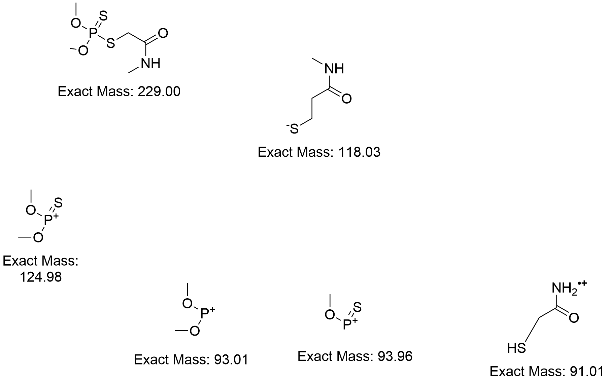

project
========

$project will solve your problem of where to start with documentation,
by providing a basic explanation of how to do it easily.

Look how easy it is to use:

    import project
    # Get your stuff done
    project.do_stuff()

Features
--------

- Be awesome
- Make things faster

Practice with ReStructured Text
-------------------------------

This is a paragraph.  It's quite
short.

   This paragraph will result in an indented block of
   text, typically used for quoting other text.

This is another one.

Practice with different styles
------------------------------
* *italicized text*
* **bold text**
* _something_
* `something`
* ~something~

Admonition Test
---------------

.. DANGER::
   Beware killer rabbits!

.. danger::
   does the capitalization matter?

.. hint::
   make sure to use the command line

Image Insert
------------

